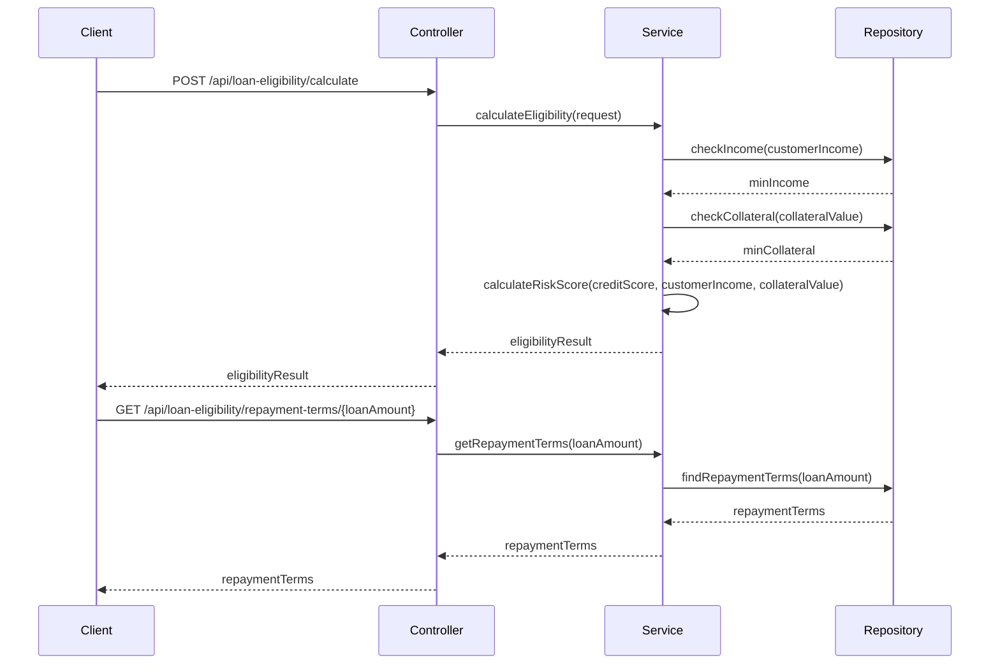

# Loan Eligibility Microservice

This project contains a Java-based Spring Boot microservice designed to determine the eligibility of customers for automobile loans based on their income and collateral value.

## Project Structure

- **src/main/java/**: Contains Java classes
  - LoanEligibilityApplication.java: Main Spring Boot application class
  - controller/LoanEligibilityController.java: REST controller for loan eligibility endpoints
  - service/LoanEligibilityService.java: Service class implementing loan eligibility logic
  - repository/CustomerRepository.java: Repository interface for customer data
  - repository/IncomeRepository.java: Repository interface for income data
  - repository/CollateralRepository.java: Repository interface for collateral data
  - repository/LoanCriteriaRepository.java: Repository interface for loan criteria data
  - repository/RepaymentTermsRepository.java: Repository interface for repayment terms data
- **src/main/resources/**: Contains application properties
  - application.properties: Database connection properties and JPA settings
- **Dockerfile**: Dockerfile to containerize the Spring Boot application
- **pom.xml**: Maven build configuration

## Advanced Features

- Transaction Management
- Historical Data Analysis
- Dynamic SQL for Flexible Criteria
- Custom Risk Scoring Functions
- Comprehensive Error Handling

## Technical Details

### Error Handling
- Exception handlers
- Transaction rollback mechanisms
- Custom error states and messages

### Performance Considerations
- Efficient data access using Spring Data JPA
- Transaction management for data consistency

## Setup Instructions

1. Build the Spring Boot application:
```bash
mvn clean install
```

2. Run the Spring Boot application:
```bash
java -jar target/loan-eligibility-microservice.jar
```

3. Build the Docker image:
```bash
docker build -t loan-eligibility-microservice .
```

4. Run the Docker container:
```bash
docker run -p 8080:8080 loan-eligibility-microservice
```

## Usage

Use the REST endpoints provided by the microservice to assess customer eligibility based on their income and collateral. The results will indicate the eligibility status, minimum and maximum loan amounts, and repayment terms.

## Implementation Flow



## License

This project is licensed under the MIT License.
